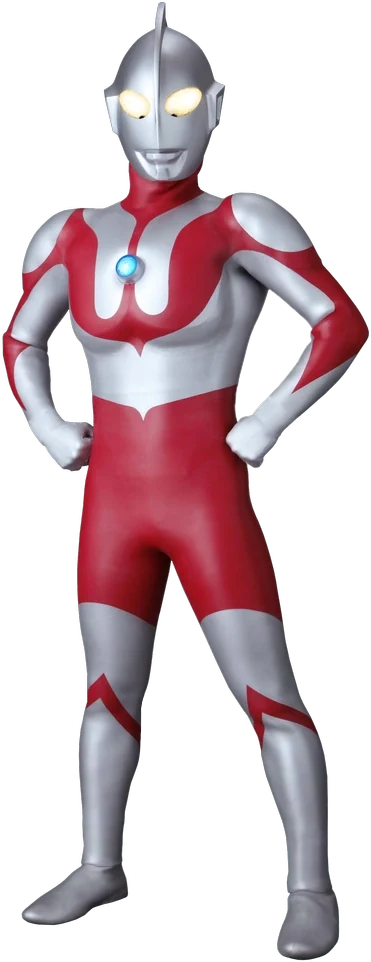
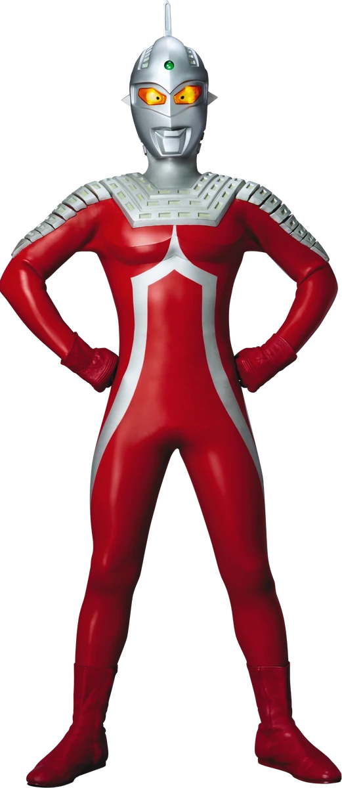
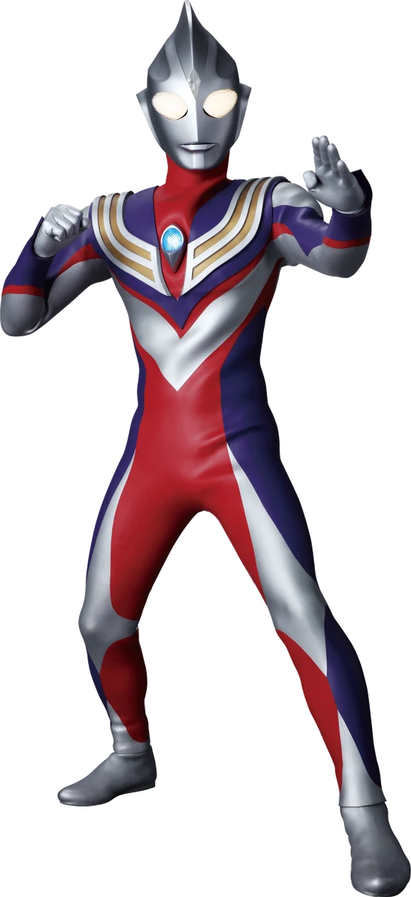
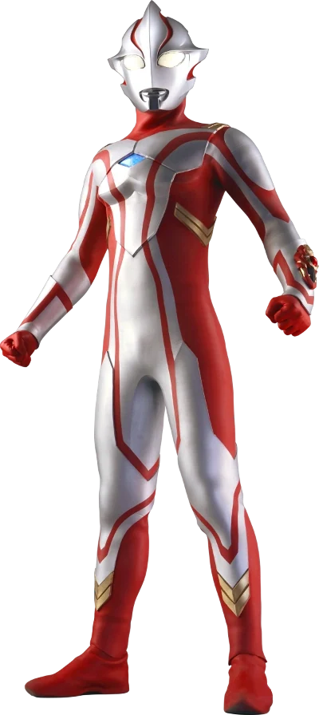
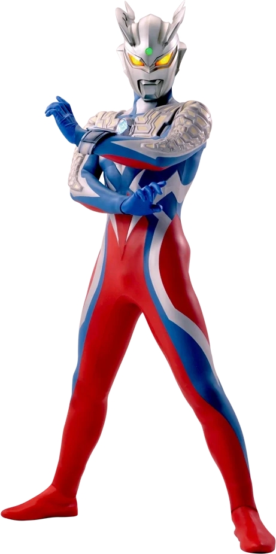
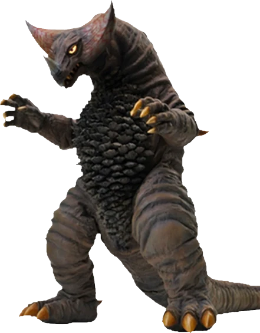
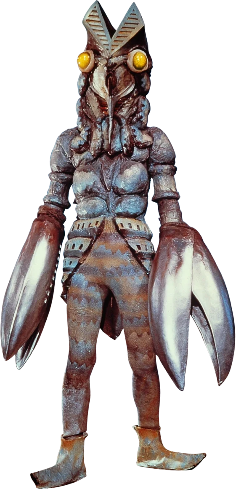
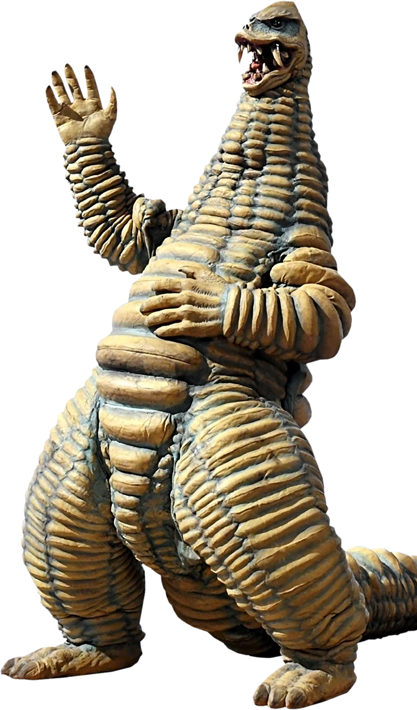
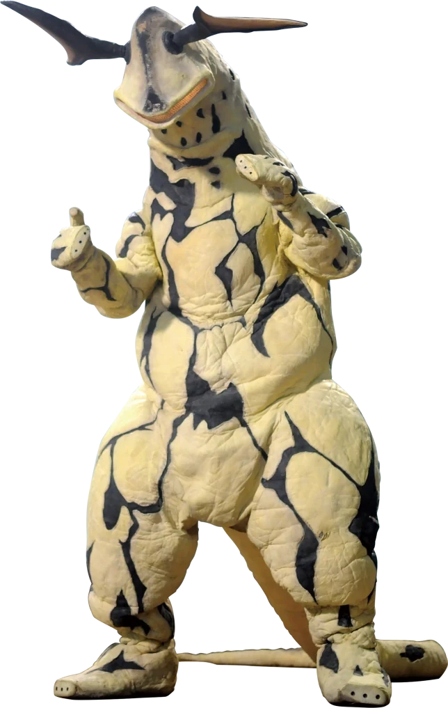
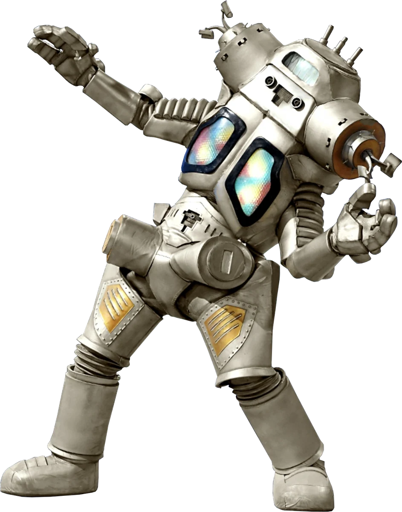

# Ultraman Hunter Assets

供《奥特曼 猎星之契》等 SillyTavern 角色卡调用的奥特曼、怪兽图片与精简资料库。

## 数据结构

```text
assets/
  ultras/{id}/portrait.webp
  monsters/{id}/portrait.webp
data/
  ultras/{id}.json
  monsters/{id}.json
manifest.json
```

前端优先读取根目录的 `manifest.json`，按名称或别名模糊匹配，再加载图片与独立资料。目前收录 44 名奥特曼、99 个怪兽或敌对角色，共 143 条。

## 远程图鉴卡片

GitHub Pages 启用后可直接嵌入：

```text
card.html?type=奥特曼&name=初代奥特曼
card.html?type=怪兽&name=哥莫拉
```

角色卡只需让模型输出简单标记：

```xml
<HunterEntity>奥特曼：初代奥特曼</HunterEntity>
<HunterEntity>怪兽：哥莫拉</HunterEntity>
```

正则仅负责把类型和名称传给远程页面。图片、资料、别名匹配和样式均由仓库维护，新增实体时无需扩写角色卡正则。

## 样例

### 奥特曼

| 名称 | 图片 | 资料 |
|---|---|---|
| 初代奥特曼 |  | [JSON](data/ultras/ultraman.json) |
| 赛文奥特曼 |  | [JSON](data/ultras/ultraseven.json) |
| 迪迦奥特曼 |  | [JSON](data/ultras/ultraman-tiga.json) |
| 梦比优斯奥特曼 |  | [JSON](data/ultras/ultraman-mebius.json) |
| 赛罗奥特曼 |  | [JSON](data/ultras/ultraman-zero.json) |

### 怪兽与敌对角色

| 名称 | 图片 | 资料 |
|---|---|---|
| 哥莫拉 |  | [JSON](data/monsters/gomora.json) |
| 巴尔坦星人 |  | [JSON](data/monsters/alien-baltan.json) |
| 雷德王 |  | [JSON](data/monsters/red-king.json) |
| 艾雷王 |  | [JSON](data/monsters/eleking.json) |
| 金古桥 |  | [JSON](data/monsters/king-joe.json) |

## CDN 地址

```text
https://testingcf.jsdelivr.net/gh/yatexy/ultraman-hunter-assets@main/manifest.json
https://testingcf.jsdelivr.net/gh/yatexy/ultraman-hunter-assets@main/assets/ultras/ultraman/portrait.webp
```

## 说明

- `portrait.png` 保存归档图，`portrait.webp` 是前端使用的压缩版本。
- 每份资料均记录百科页面和原始图片地址，方便校对与替换。
- 条目中的“猎星之契评级”沿用当前角色卡规则，不代表官方评级。
- 本线原创或派生对象会明确沿用原型图或使用原创占位视觉，不冒充原作独立档案。
